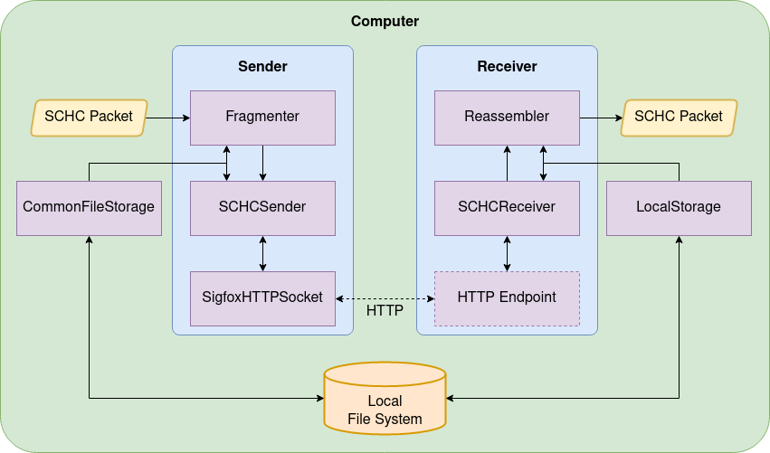

# SCHC-over-Sigfox

This branch contains a simulation of the [SCHC Framework](https://datatracker.ietf.org/doc/html/rfc8724) over the Sigfox
Network, using the parameters and behaviors defined in
the [Sigfox SCHC Profile](https://datatracker.ietf.org/doc/html/draft-ietf-lpwan-schc-over-sigfox). It is written in
such a way to simulate the functioning of a LoPy4 device as the sender side and stateless Cloud Functions in Google
Cloud Platform as the receiver side.

A LoPy4-compatible implementation of the sender side is in the `sender` branch, whilst a GCP-deployable implementation of the receiver side is in the `receiver` branch.
A partial integration with Firebase is in the `simulator-firebase` branch meant for testing new updates.

## About

### Static Context Header Compression and Fragmentation

The Generic Framework for Static Context Header Compression and Fragmentation (SCHC) specification describes two
mechanisms: i) an application header compression scheme, and ii) a frame fragmentation and loss recovery functionality.
SCHC offers a great level of flexibility that can be tailored for different Low Power Wide Area Network (LPWAN)
technologies.

The SCHC specification defines a generic fragmentation functionality that allows sending data packets or files larger
than the maximum size of a Sigfox payload. The functionality also defines a mechanism to send reliably multiple
messages, by allowing to resend selectively any lost fragments. The Sigfox SCHC Profile uses the ACK-on-Error mode,
sending downlink messages only when fragments are lost.

## Structure

This branch is composed of the following modules and scripts.

* `config` contains configuration modules.
* `db` contains classes that manage data storage in different environments.
* `Entities` contains classes that contain data pertaining to a particular SCHC transmission and perform the F/R
  procedure.
* `Messages` is composed of classes that encapsulate the information and functions of all types of messages of
  SCHC/Sigfox.
* `Sockets` contains different implementations of the communication procedure between each component of the system.
* `utils` contains functions used throughout the project.

An overview of the simulation environment is shown in the following picture.

## Authors

* **Sergio Aguilar**: Profile coauthor, developer
* **Sandra Céspedes**: Profile coauthor, advisor
* **Carles Gomez**: Profile coauthor, advisor
* **Rafael Vidal**: Advisor
* **Antonis Platis**: Developer
* **Diego Wistuba**: Profile coauthor, developer
* **Juan Carlos Zúñiga**: Profile coauthor, advisor

## Known issues:

* After successfully completing a SCHC Session of n SCHC Fragments, if the next session uses the same Rule ID as the
  previous one, is composed of the same number of SCHC Fragments in its last window, and if the first delivered message
  of that session is an All-1, the Receiver will interpret that All-1 as a retransmission of the last All-1 of the
  previous section, responding with the corresponding complete Compound ACK. Selecting different Rule IDs for
  consecutive SCHC transmissions is suggested in order to avoid this issue.

## License

This project is licensed under the MIT License. See the [LICENSE](LICENSE) file
for details.